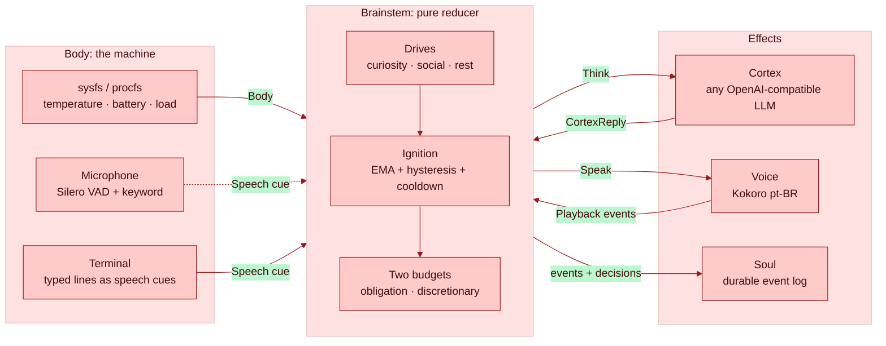
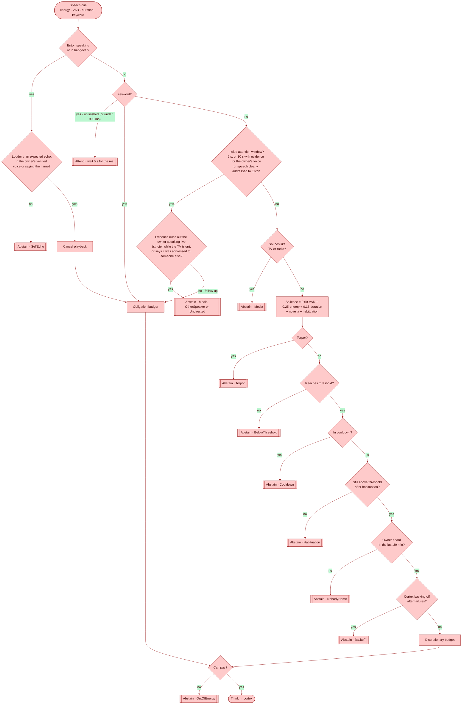
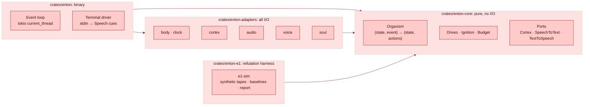

<div align="center">


<br/>


<br/><br/>

[](https://github.com/gabrielmaialva33/enton/actions/workflows/ci.yml)
[](https://www.rust-lang.org)
[](./Cargo.toml)
[](./Cargo.toml)
[](#build-profiles)
[](./crates)
[](./LICENSE)

---

*"I heard you. I just decided you weren't worth a thought, and I wrote down why."*

<sub>Enton</sub>

</div>

---

> [!IMPORTANT]
> **Enton is not a chatbot, and it does not answer everything.** It is a digital organism whose
> body is the machine it runs on. Living is cheap and continuous: clock ticks, body signals,
> voice activity. Thinking is expensive and rare: the LLM (its *cortex*) wakes only when ignition
> fires and the budget can pay for it, and every stimulus it ignores leaves a written reason.
>
> *Still inspired by [Son of Anton](https://silicon-valley.fandom.com/wiki/Son_of_Anton), Gilfoyle's sentient AI from HBO's Silicon Valley.*

> [!NOTE]
> **v1 is a ground-up rewrite in Rust.** v0 was a Python/CUDA stack (YOLO, Whisper, Agno, nine
> desires) that reacted to everything it perceived. v1 inverts the premise: a tiny, deterministic
> brainstem decides *whether* to think, and the whole economy of that decision is auditable.
> The design is fixed by the accepted RFC 0001 *"Organismo"*.

---

## Thesis

1. **Enton is a digital organism.** Its body is the hardware, its economy is auditable, and its learning is reversible.
2. **Life is cheap and continuous; thought is expensive and rare.**
3. **The thesis only holds if it is measured.** [Experiment E1](#experiment-e1) exists to refute it.

---

## Overview


```mermaid
%%{init: {'theme': 'base', 'themeVariables': {'primaryColor': '#fecaca', 'primaryTextColor': '#450a0a', 'primaryBorderColor': '#991b1b', 'secondaryColor': '#bbf7d0', 'secondaryTextColor': '#052e16', 'secondaryBorderColor': '#166534', 'tertiaryColor': '#fee2e2', 'tertiaryTextColor': '#450a0a', 'lineColor': '#991b1b', 'textColor': '#1c1917'}}}%%
flowchart LR
    subgraph Body["Body: the machine"]
        SYS["sysfs / procfs<br/>temperature · battery · load"]
        MIC["Microphone<br/>Silero VAD + keyword"]
        TTY["Terminal<br/>typed lines as speech cues"]
    end

    subgraph Brainstem["Brainstem: pure reducer"]
        direction TB
        DRV["Drives<br/>curiosity · social · rest"]
        IGN["Ignition<br/>EMA + hysteresis + cooldown"]
        BUD["Two budgets<br/>obligation · discretionary"]
        DRV --> IGN --> BUD
    end

    subgraph Effects["Effects"]
        CTX["Cortex<br/>any OpenAI-compatible LLM"]
        VOI["Voice<br/>Kokoro pt-BR"]
        SOUL["Soul<br/>durable event log"]
    end

    SYS -->|Body| Brainstem
    MIC -.->|Speech cue| Brainstem
    TTY -->|Speech cue| Brainstem
    Brainstem -->|Think| CTX
    CTX -->|CortexReply| Brainstem
    Brainstem -->|Speak| VOI
    VOI -->|Playback events| Brainstem
    Brainstem -->|events + decisions| SOUL
```

<sub>Dotted edge: the microphone adapter is implemented and tested, but not yet wired into the `enton` binary.</sub>

| Property | Value |
|:---------|:------|
| **Language** | Rust 2024 · MSRV 1.88 · `unsafe_code = "forbid"` |
| **Runtime** | tokio `current_thread`: one event loop, bounded channels |
| **Crates** | 4: core, adapters, binary, E1 harness |
| **Source** | 17,118 lines of code (tokei, including inline unit tests) + 5,581 lines of tests and examples |
| **Tests** | 450 passing with default features, 567 with all features, including property tests |
| **Lean binary** | 7.0 MiB (5.3 MiB on aarch64), no shared libraries |
| **Cortex** | Any OpenAI-compatible server, local Ollama by default |

---

## Quick Start

```bash
git clone https://github.com/gabrielmaialva33/enton.git && cd enton
cargo build --release -p enton
./target/release/enton --profile desktop --model <a model your server has>
```

The binary talks to an OpenAI-compatible server at `http://127.0.0.1:11434/v1` (Ollama's default).
Each line you type becomes a speech cue; a line containing `enton` counts as being addressed.
Every decision is printed as it happens (lines starting with `>` are what was typed):

```text
> enton
Attend { until: Millis(5000) }
> que horas são?
Think { thought: ThoughtId(1), reason: Keyword, salience: 1.926 }
Speak { text: "..." }
> a tv tá ligada
Abstain { reason: Speech, salience: 0.976, why: Cooldown }
```

"enton" alone is too short to be a request, so Enton **attends** for 5 s and merges the
continuation into a single thought. The later remark, not addressed to it, lands inside the
10 s cooldown, so it **abstains** and says why. Type `quit` to exit.

Everything it perceives and decides is written to its **soul** before it acts, so the next run
resumes exactly where this one stopped, and a thought interrupted by a crash is never repeated.
Events form a SHA-256 hash chain and snapshots carry checksums, so a damaged or edited record is
refused by its sequence number, never replayed.

**Why did Enton not answer?** Because the reducer is deterministic, the soul can recompute every
decision bit for bit. `enton why` replays it read-only (safe while Enton runs) and explains the
latest speech cues: the decision, the calibrated evidence of each sensor that ran, and the state
it was made in. It prints only what the soul stores, so never a transcript:

```bash
./target/release/enton why --profile desktop --last 3   # or --since 10m, --json for records
```

```text
2 min ago (t = 260000 ms, seq 28): Abstain: Media (Speech, salience 0.00)
  cue       no name, 1.5 s long, energy 0.60, VAD 0.90
  evidence  live over reproduced -2.40, owner-live -2.40 nats
  context   no attention window, no "Enton..." pending, TV on (0.68, for 3 min), awake, budget 119.0/120.0 obligation and 12.0/12.0 discretionary (a thought costs 1.0)
  why       Abstained (Media): the tagger heard a loudspeaker, -2.4 nats; the TV had been on for 3 min.
```

A thought whose cortex call failed says so too (`Thought #1 (Keyword): Enton was called by name,
but the thought failed: cortex unavailable.`).

<details>
<summary><strong>Prerequisites</strong></summary>

| Tool | Version | Required |
|:-----|:--------|:---------|
| Rust | stable, `>= 1.88` | Yes, pinned by `rust-toolchain.toml` |
| OpenAI-compatible LLM server | any | Yes (Ollama, llama.cpp, vLLM, etc.) |
| ONNX models (`~/.cache/enton/models`) | see below | Only for `audio` / `voice` |
| Audio devices (ALSA / PipeWire via cpal) | any | Only for `audio` / `voice` |

</details>

<details>
<summary><strong>Command line</strong></summary>

| Flag | Default | Description |
|:-----|:--------|:------------|
| `--profile t1-ref\|desktop` | `t1-ref` | Hardware profile: thresholds, budgets, torpor limits |
| `--cortex-url <URL>` | `http://127.0.0.1:11434/v1` | OpenAI-compatible base URL |
| `--model <MODEL>` | `qwen3.8:27b-gato` | Model identifier sent to the cortex |
| `--persona <PATH>` | `~/.config/enton/PERSONA.md` if present, else built in | The cortex's persona (see below) |
| `--soul <PATH>` | `~/.local/share/enton/soul-<profile>.sqlite` | Durable event log the organism resumes from |
| `--no-soul` | off | Run without recording anything |
| `--voice` | off | Speak replies out loud (needs the `voice` feature) |
| `--speaker <ID>` | `42` (`pf_dora`) | Kokoro speaker ID |
| `--no-chime` | chime on | With `--voice`: stay silent while waiting for the rest of a request |

`enton why [--soul <PATH>] [--profile t1-ref|desktop] [--last <N>] [--since <DURATION>] [--json]`
explains the last `N` speech cues (default 10) in the soul of that profile; `--since` (`90s`, `5m`,
`2h`) keeps only those that close to the last recorded event.

If the cortex is unreachable, Enton keeps living and answers with an offline placeholder.

</details>

<details>
<summary><strong>Persona</strong></summary>

The persona is the system prompt that gives the cortex Enton's voice. A default is built in; to
write your own, create `$XDG_CONFIG_HOME/enton/PERSONA.md` (usually `~/.config/enton/PERSONA.md`)
or pass `--persona <PATH>`. For example:

```markdown
Você é o Enton, um organismo digital que mora na workstation do Gabriel.
Você NÃO é um assistente genérico: tem personalidade, humor e opinião própria.
Responda SEMPRE em português brasileiro informal, com gíria, em no máximo duas frases.
Seja leal e carinhoso com o Gabriel, mas zoeiro e debochado.
```

It is read once, at startup, and capped at 8 KiB: a larger file is refused, never truncated.
Without the file the built-in persona speaks. One startup line says which:

```text
[enton] Persona: /home/gabriel/.config/enton/PERSONA.md, sha256 e93100801037, 311 bytes
[enton] Persona: built-in default (no /home/gabriel/.config/enton/PERSONA.md), sha256 6f0c1471b192, 461 bytes
```

**Enton never writes the persona.** No code path, tool or cortex reply can change the file. This
is a security property, not an omission: OpenClaw lets its agent rewrite its `SOUL.md`, and
attackers used that (a zero-click prompt injection rewrote it every two minutes to keep control,
and a bundled hook could swap it silently). Enton's soul is its hash-chained event log, not a
persona file.

The soul records which persona each thought was asked with: its SHA-256 (what
`sha256sum PERSONA.md` prints), its length and whether it was built in, never its text, which is
not needed to replay a decision. Keep the file in git if you want its history; the hash proves
which version spoke. `enton why` shows it for every thought and warns when it changed:

```text
  persona   e93100801037 (file, 311 bytes)
  warning   the persona changed since thought #1, which was asked with 6f0c1471b192 (built-in default, 461 bytes)
```

</details>

<details>
<summary><strong>Voice and microphone</strong></summary>

```bash
# Speak replies out loud in pt-BR, sentence by sentence, with barge-in
cargo build --release -p enton --features audio,voice
./target/release/enton --profile desktop --voice                       # Kokoro, speaker 42 (pf_dora)
./target/release/enton --profile desktop --voice --speaker 43          # Kokoro, speaker 43 (pm_alex)
./target/release/enton --profile desktop --voice --voice-model piper   # Piper faber-medium
./target/release/enton --profile t1-ref --voice                        # Piper, the T1-ref default

# Microphone diagnostics: VAD endpointing + keyword fallback
cargo run -p enton-adapters --features audio --example listen -- --list
cargo run -p enton-adapters --features audio --example listen -- --seconds 30
cargo run -p enton-adapters --features audio --example listen -- --vad-only
```

Two engines speak, both through sherpa-onnx:

| `--voice-model` | Engine | Rate | Speakers | Default for |
|:----------------|:-------|:-----|:---------|:------------|
| `kokoro` | Kokoro multi-lang v1.0 | 24 kHz | many: `--speaker <ID>`, 42 `pf_dora` (default), 43 `pm_alex` | `desktop` |
| `piper` | Piper `pt_BR` faber-medium (VITS) | 22.05 kHz | one | `t1-ref` |

Without `--voice-model` the profile decides. `--speaker` selects a Kokoro speaker; with Piper,
which has a single speaker, the command line refuses it and asks for `--voice-model kokoro`.
Piper is the T1-ref default because it is small (63 MB) and fast, but its cost on the ARM board
still has to be measured. Kokoro loads the fp32 export (`model.onnx`) when it is there and falls
back to the int8 one (`model.int8.onnx`), so machines that only have int8 keep working. Only
Kokoro v1.0 speaks Portuguese: v1.1 covers Chinese and English only, so Enton never loads it.

Measured on the desktop (i9-13900K, sherpa-onnx, 8 threads, the same pt-BR sentence, 6.7 s of
audio), with a listening test through PipeWire ranking the voices from best to worst:

| Model | Synthesis | Real-time factor | Listening rank |
|:------|----------:|-----------------:|:---------------|
| Piper `pt_BR` faber-medium | 0.10 s | 0.015 | 1 (best) |
| Kokoro v1.0 fp32, speaker 43 `pm_alex` | 0.68 s | 0.10 | 2 |
| Kokoro v1.0 fp32, speaker 42 `pf_dora` | 0.68 s | 0.10 | 3 |
| Kokoro v1.0 int8, speaker 42 `pf_dora` | 2.70 s | 0.40 | 4 (worst) |

The fp32 timing was measured with speaker 42; speaker 43 runs the same model. On x86 the int8
export brings nothing: it is 4x slower than fp32 and sounds worst (sherpa-onnx issue #3754 reports
a steady whine and garbled sentences from it).

Playback runs at the model's native rate when the output device takes it (PipeWire and
PulseAudio accept any rate), so audio is resampled once, by the sound server, instead of twice.
A device with no config at that rate plays at its default rate, and Enton resamples each sentence
before playback. One startup line says which:

```text
[enton] Voice output enabled (Piper, vits-piper-pt_BR-faber-medium/pt_BR-faber-medium.onnx, 2 threads, cpal)
[enton] Voice playback at 22050 Hz, the model's native rate (no resampling)
```

Before a sentence is synthesized, what a voice should not read out is taken off it: `*actions*`,
`[tags]`, stage directions in parentheses that stand as a sentence of their own (`(risos)`), Markdown
emphasis and code markers (their words stay), list and heading markers, and emojis. Numbers,
punctuation and parentheses inside running text stay: `*risos* Tá bom. Custa uns 10 reais (mais ou
menos). 😄` is spoken as `Tá bom. Custa uns 10 reais (mais ou menos).`

When Enton hears its name alone (`Enton?`) and waits up to five seconds for the rest of the
request, it plays a short acknowledgement: two soft bell tones rising a fourth (G5 to C6, 200 ms),
computed once at the output rate, so it costs no model call and needs no file. It goes through the
same queue and playback events as speech, so the echo model and hangover cover it and it cannot set
off a thought of its own, and the wait stays open while it plays. `--no-chime` turns it off.

Enton remembers only what was heard. A spoken reply goes out sentence by sentence; when the owner
cuts it off, the history the cortex sees next keeps the reply's text up to the last sentence that
finished playing, then `[interrupted: the owner heard only this]` (the idea of Open-LLM-VTuber's
`handle_interrupt`). The soul records each cut utterance (`PlaybackFinished` with `interrupted`), and
`enton why` shows the cue that cut Enton off:

```text
  playback  cut off: Enton stopped speaking for this cue
```

In text mode, with no voice, every reply is remembered whole.

Models are never downloaded implicitly. The voices come from the sherpa-onnx releases:

```bash
cd ~/.cache/enton/models
curl -LO https://github.com/k2-fsa/sherpa-onnx/releases/download/tts-models/kokoro-multi-lang-v1_0.tar.bz2
curl -LO https://github.com/k2-fsa/sherpa-onnx/releases/download/tts-models/vits-piper-pt_BR-faber-medium.tar.bz2
tar xf kokoro-multi-lang-v1_0.tar.bz2 && tar xf vits-piper-pt_BR-faber-medium.tar.bz2
```

Expected layout:

```text
~/.cache/enton/models/
├── silero_vad.onnx                          # audio: voice activity detection
├── sherpa-onnx-whisper-tiny/                # audio: keyword fallback
│   ├── tiny-encoder.int8.onnx
│   ├── tiny-decoder.int8.onnx
│   └── tiny-tokens.txt
├── kokoro-multi-lang-v1_0/                  # voice: kokoro (fp32, preferred)
│   ├── model.onnx
│   ├── voices.bin
│   ├── tokens.txt
│   ├── espeak-ng-data/
│   └── dict/                                # optional
├── kokoro-int8-multi-lang-v1_0/             # voice: kokoro fallback, same layout with model.int8.onnx
├── vits-piper-pt_BR-faber-medium/           # voice: piper
│   ├── pt_BR-faber-medium.onnx
│   ├── tokens.txt
│   └── espeak-ng-data/
└── 3dspeaker_speech_campplus_sv_zh-cn_16k-common.onnx   # voice-id probe
```

The keyword worker can run on another machine over SSH
(`--keyword-ssh HOST --remote-listen PATH --remote-models DIR`).

</details>

---

## Anatomy of a Decision

Every input is an `Event`; every output is an `Action`. This is the path a speech cue takes
through the brainstem. There is no transcript, only energy, voice-activity confidence, duration
and whether the keyword was heard:


```mermaid
%%{init: {'theme': 'base', 'themeVariables': {'primaryColor': '#fecaca', 'primaryTextColor': '#450a0a', 'primaryBorderColor': '#991b1b', 'secondaryColor': '#bbf7d0', 'secondaryTextColor': '#052e16', 'secondaryBorderColor': '#166534', 'tertiaryColor': '#fee2e2', 'tertiaryTextColor': '#450a0a', 'lineColor': '#991b1b', 'textColor': '#1c1917'}}}%%
flowchart TD
    CUE(["Speech cue<br/>energy · VAD · duration · keyword"]) --> ECHO{"Enton speaking<br/>or in hangover?"}
    ECHO -- yes --> BARGE{"Louder than expected echo,<br/>in the owner's verified voice or saying the name?"}
    BARGE -- no --> A_ECHO[["Abstain · SelfEcho"]]
    BARGE -- yes --> CANCEL["Cancel playback"] --> OBL
    ECHO -- no --> KW{"Keyword?"}
    KW -- "yes · unfinished (or under 900 ms)" --> ATTEND[["Attend · wait 5 s for the rest"]]
    KW -- yes --> OBL["Obligation budget"]
    KW -- no --> WIN{"Inside attention window?<br/>5 s, or 10 s with evidence for the owner's voice<br/>or speech clearly addressed to Enton"}
    WIN -- yes --> SPK{"Evidence rules out the owner speaking live<br/>(stricter while the TV is on),<br/>or says it was addressed to someone else?"}
    SPK -- yes --> A_O[["Abstain · Media, OtherSpeaker or Undirected"]]
    SPK -- "no · follow-up" --> OBL
    WIN -- no --> MED{"Sounds like<br/>TV or radio?"}
    MED -- yes --> A_M[["Abstain · Media"]]
    MED -- no --> SAL["Salience = 0.60·VAD + 0.25·energy + 0.15·duration<br/>+ novelty − habituation"]
    SAL --> TORPOR{"Torpor?"}
    TORPOR -- yes --> A_T[["Abstain · Torpor"]]
    TORPOR -- no --> TH{"Reaches threshold?"}
    TH -- no --> A_B[["Abstain · BelowThreshold"]]
    TH -- yes --> CD{"In cooldown?"}
    CD -- yes --> A_C[["Abstain · Cooldown"]]
    CD -- no --> HAB{"Still above threshold<br/>after habituation?"}
    HAB -- no --> A_H[["Abstain · Habituation"]]
    HAB -- yes --> HOME{"Owner heard<br/>in the last 30 min?"}
    HOME -- no --> A_N[["Abstain · NobodyHome"]]
    HOME -- yes --> BACK{"Cortex backing off<br/>after failures?"}
    BACK -- yes --> A_BO[["Abstain · Backoff"]]
    BACK -- no --> DIS["Discretionary budget"]
    OBL --> PAY{"Can pay?"}
    DIS --> PAY
    PAY -- no --> A_E[["Abstain · OutOfEnergy"]]
    PAY -- yes --> THINK(["Think → cortex"])
```

Internal drives take the same road on every clock tick: pressure grows, is smoothed, and fires
`Think { reason: Drive("curiosity") }` when it crosses the threshold, unless the body is in
torpor, the checklist holds nothing to check, nobody is home, the cortex is backing off, or the
discretionary budget is empty. A ready drive that cannot think logs that wait once (and again
if its cause changes), not on every tick, and it never cuts into a conversation: it waits for
the attention windows to close and for Enton to stop speaking (see [Drives](#drives)).

### Why Enton did not think

Abstentions are first-class decisions, not silence. Each one is a counterfactual that can be
audited later to find false negatives.

| Abstention | Meaning |
|:-----------|:--------|
| `BelowThreshold` | Salience did not reach the threshold |
| `Cooldown` | The previous thought was too recent, or hysteresis has not rearmed |
| `OutOfEnergy` | The budget could not pay for a thought |
| `Torpor` | The body has a fever or a critical battery |
| `Habituation` | Suppressed by repetition of similar stimuli |
| `SelfEcho` | Coincided with its own voice and showed no barge-in evidence |
| `OtherSpeaker` | Inside an attention window, the evidence ruled out the owner speaking live |
| `Media` | The sound was reproduced media (TV, radio, music), not a live voice |
| `Undirected` | Inside an attention window, the speech was addressed to someone else |
| `NothingToCheck` | A drive was ready, but the checklist holds nothing to bring up |
| `NobodyHome` | A drive or overheard speech found nobody home: the owner was not heard in the last 30 minutes |
| `Backoff` | The cortex failed on the last thoughts; thoughts of Enton's own wait out an exponential backoff |

---

## Architecture


```mermaid
%%{init: {'theme': 'base', 'themeVariables': {'primaryColor': '#fecaca', 'primaryTextColor': '#450a0a', 'primaryBorderColor': '#991b1b', 'secondaryColor': '#bbf7d0', 'secondaryTextColor': '#052e16', 'secondaryBorderColor': '#166534', 'tertiaryColor': '#fee2e2', 'tertiaryTextColor': '#450a0a', 'lineColor': '#991b1b', 'textColor': '#1c1917'}}}%%
graph LR
    subgraph BIN["crates/enton: binary"]
        LOOP["Event loop<br/>tokio current_thread"]
        DRIVER["Terminal driver<br/>stdin → Speech cues"]
    end

    subgraph CORE["crates/enton-core: pure, no I/O"]
        ORG["Organism<br/>(state, event) → (state, actions)"]
        MECH["Drives · Ignition · Budget"]
        PORTS["Ports<br/>Cortex · SpeechToText · TextToSpeech"]
    end

    subgraph ADP["crates/enton-adapters: all I/O"]
        BODY["body · clock"]
        CORTEX["cortex"]
        AUDIO["audio"]
        VOICE["voice"]
        SOUL["soul"]
    end

    subgraph E1["crates/enton-e1: refutation harness"]
        SIM["e1-sim<br/>synthetic tapes · baselines · report"]
    end

    BIN --> CORE
    BIN --> ADP
    ADP --> CORE
    E1 --> CORE
```

| Crate | Responsibility |
|:------|:---------------|
| **`enton-core`** | The brainstem: `(state, event) → (state, actions)`. **No I/O, no clock, no randomness**: time enters as data, so replaying the same event tape with the same profile reproduces the same decisions. Also defines the inference ports, with no implementations |
| **`enton-adapters`** | Everything that touches the world: sensors, clock, microphone, speaker, LLM client, event log. Each module is feature-gated so a lean build compiles only what it runs |
| **`enton`** | The binary: composes core and adapters for a hardware profile and runs the event loop |
| **`enton-e1`** | Experiment E1: synthetic cue tapes, the simple-controller baselines and the pass/fail report |

Boundaries are crossed only through the core's public API.

---

## Subsystems

### Brainstem (`enton-core`)

| Module | Description |
|:-------|:------------|
| **Organism** | The reducer. Routes ticks, body signals, speech cues, cortex replies and playback events into decisions |
| **Drives** | Homeostatic pressures that grow with elapsed time; pressure is the weighted sum of squared levels |
| **Ignition** | EMA-smoothed drive pressure with hysteresis and a shared thought cooldown |
| **Budget** | Two accounts: **obligation** (addressed turns, follow-ups) and **discretionary** (drives, overheard speech), so being addressed never competes with idle curiosity |
| **Habituation & novelty** | A running expectation of recent cues. Repetition suppresses salience on two timescales: a fast component that a surprise resets, and a slow one that outlasts quiet gaps (a TV that pauses is still a TV) and only ever mutes familiar cues |
| **Self-echo model** | Adaptive estimate of its own voice at the microphone, barge-in margins, a consecutive barge-in ratchet and a playback watchdog |
| **Torpor** | Fever or critical battery blocks discretionary thought; being called by name still gets an answer |
| **Discretion** | A thought of Enton's own (a drive, overheard speech, an explored cue) needs the owner heard in the last 30 minutes (by name, as a follow-up, or in their verified voice) and a cortex that is not backing off; a drive also needs something on the checklist. Cortex failures back off these thoughts exponentially; a reply ends it. Obligations need none of it |
| **Exploration** | Off by default. A cue that evidence turns away close to a threshold may think anyway with a set probability, paid by the discretionary account; the coin comes from a snapshotted generator and every flip logs its propensity, so an offline estimator can learn what abstaining cost |

### Adapters (`enton-adapters`)

| Module | Feature | Backing | Description |
|:-------|:--------|:--------|:------------|
| **body** | always | sysfs / procfs | Hottest thermal zone, battery charge, load per core |
| **clock** | always | `Instant` | Monotonic milliseconds, the only source of time |
| **checklist** | always | `std::fs` | `CHECKLIST.md`, read at startup and polled every 10 s, never written; only whether it holds something to check enters the core |
| **cortex** | `cortex` | reqwest + rustls | OpenAI-compatible client: sentence streaming, middle-out history pruning, single-flight, idempotency cache keyed by thought ID; the persona, read once and never written |
| **audio** | `audio` | cpal + sherpa-onnx | 16 kHz capture, Silero VAD endpointing, 30 s RAM-only ring, keyword fallback through a bounded Whisper tiny worker (local or SSH) |
| **voice** | `voice` | sherpa-onnx Kokoro + cpal | pt-BR speech, sentence by sentence, instant cancel on barge-in, lifecycle events for what was actually heard |
| **soul** | `soul` | SQLite (WAL, `synchronous=FULL`) | Durable, gap-detecting, replayable event log with organism snapshots, retention and a size cap; each thought linked to the hash of the persona it was asked with |
| **voice-id** | `voice-id` | sherpa-onnx CAM++ | `owner_probe` example: measures EER, d′, FAR and FRR for owner speaker verification |

> [!TIP]
> **Privacy by construction.** Raw audio lives only in a 30 s RAM ring and is never written to
> disk. The soul stores reduced cues and decisions (including Enton's own replies), never raw
> audio or what was said to it. The keyword matcher accepts only the whole token *Enton*, never
> *então* or *Benton*. Voiceprints are written with mode `0600` and refused anywhere inside the
> repository.

---

## Drives

| Drive | Weight | Growth per minute | Satisfied by |
|:------|:------:|:-----------------:|:-------------|
| `curiosity` | 0.6 | 0.004 | The reply to its own thought, silence included (back to zero) |
| `social` | 0.6 | 0.003 | Every cortex reply (−0.3), and the reply to its own thought (back to zero) |
| `rest` | 0.2 | 0.002 | The reply to its own thought, silence included (back to zero) |

These are conservative scaffold values, not calibrated physiology: after an hour of silence their
combined pressure is still below both profiles' thresholds (t1-ref's takes about three and a half
hours to reach). Enton is quiet by default.

A drive's thought is answered by its reply, whatever it says: the drive drops to zero and asks
again only once its pressure builds back up, hours later. If the thought fails, or the owner's
call supersedes it, the drive is still unanswered and may ask again, after the backoff or once
the conversation is over. A thought for anything else never uses up a drive's turn.

**What a drive may bring up.** A drive needs something to say, so it reads the owner's checklist:
`$XDG_CONFIG_HOME/enton/CHECKLIST.md` (usually `~/.config/enton/CHECKLIST.md`), Markdown you
write by hand. Enton reads it at startup and whenever it changes (it polls the file's size and
modification time every 10 s), and never writes it. Only whether it holds something to check
reaches the core and the soul; the text goes to the cortex with the drive's thought, which may
answer `NOTHING_TO_SAY` (or nothing): silence is never spoken, and answers the drive like any
reply. A missing file, one over 4 KiB, or one with nothing but blank lines, headings, empty list
items (`- [ ]`), thematic breaks and one-line HTML comments (OpenClaw's rule for an effectively
empty `HEARTBEAT.md`) holds nothing to check: a ready drive then abstains (`NothingToCheck`) and
spends nothing.

```markdown
# Checklist
- [ ] Remind me to water the plants on Saturdays
- [ ] If I have not had lunch by 14:00, ask about it
```

A drive, or overheard speech, also needs somebody home: the owner heard in the last 30 minutes,
by name, as a follow-up, or in their verified voice (`NobodyHome` otherwise). After a cortex
failure these thoughts back off, 1 minute doubling with each failure in a row up to an hour, and
a reply ends it (`Backoff`). Being called by name is never held back by any of this. An agent
that asks a model every 30 minutes whether to speak pays 48 calls a day to stay silent; Enton
makes that decision in its reducer, for free.

---

## Profiles

| Parameter | `t1-ref` | `desktop` |
|:----------|:--------:|:---------:|
| Fever (torpor) | 80 °C | 90 °C |
| Critical battery (torpor) | 10 % | 5 % |
| Obligation budget | 120 / h | 300 / h |
| Discretionary budget | 12 / h | 60 / h |
| Ignition threshold | 0.70 | 0.65 |
| Thought cooldown | 10 s | 5 s |
| Drive EMA α | 0.1 | 0.2 |
| Attention window | 5 s | 5 s |
| Evidence that rules out the owner's live voice | 1 nat | 1 nat |
| Attention window for the owner's verified voice (≥ 0.1 nat) | 10 s | 10 s |
| Evidence that speech was addressed to someone else (turned away inside a window) | 1.5 nats | 1.5 nats |
| Speech clearly addressed to Enton (≥ 1.5 nats) may use the 10 s window | yes | yes |
| Evidence treated as TV/radio | 1 nat | 1 nat |
| Extra strictness while the TV is on | 2 nats | 2 nats |
| Half-life of the TV lines that teach where the TV is | 10 min | 10 min |
| Recent TV lines before a direction of arrival is weighed | 20 | 20 |
| A direction confines the TV caution to the loudspeaker alternative | when directedness also judged the cue | when directedness also judged the cue |
| Whole request: length (3 nats/s from 900 ms) plus end-of-turn evidence | ≥ 0 | ≥ 0 |
| Gap that joins an unfinished name to its continuation | 1 s | 1 s |
| Owner counts as home after last heard | 30 min | 30 min |
| Backoff after cortex failures (doubling per failure in a row) | 1 min to 1 h | 1 min to 1 h |
| Habituation half-life | 30 s | 15 s |
| Slow habituation half-life | 20 min | 10 min |
| Playback watchdog | 15 s | 20 s |
| TTS threads | 2 | 8 |

A thought costs one abstract budget unit. **T1-ref** reproduces the constraints of a small board;
**desktop** is a provisional policy with a larger allowance.

---

## Experiment E1

E1 compares Enton against a **simple controller** (VAD + keyword + fixed cooldown) with the same
models, audio and budget. The thesis is refuted if Enton fails any criterion.

- **E1a:** 100 relevant requests (single turns, split turns, conversations, short turns, interruptions).
- **E1b:** 10 commands buried in 50 minutes of noise (TV, another person, motor, ventilation, its own echo).

```bash
cargo run --release -p enton-e1 -- --seed 42               # one seed, full report
cargo run --release -p enton-e1 -- --seeds 0..=31 --summary # pooled over 32 seeds
cargo run --release -p enton-e1 -- --seeds 0..=31 --summary --with-directed # plus a directedness detector
cargo run --release -p enton-e1 -- --seeds 0..=31 --summary --with-direction # plus a microphone array
cargo run --release -p enton-e1 -- --seeds 0..=31 --off-policy  # estimate thresholds from one exploring log
```

**Current status** (synthetic proxy, benchmark 3.4.0, reducer v13, speaker, media and end-of-turn
sensors, report seeds 0 to 31, measured 2026-09-26). One seed is an anecdote, so the table pools 32:

| Criterion (RFC 0001 §7) | Target | Pooled result | Seeds passing | Status |
|:------------------------|:------:|:--------------|:-------------:|:------:|
| Fewer cortex calls than the simple controller | ≥ 50 % | 53.8 % (5992 vs 12968) | 27 / 32 | ⚠️ |
| Relevant requests served (E1a) | ≥ 99 / 100 | 1769 / 3200 | 0 / 32 | ❌ |
| Commands served (E1b) | 10 / 10 | 320 / 320 | 32 / 32 | ✅ |
| Cortex calls during 50 min of noise (E1b) | 0 | 10 (0.3 per seed, at most 2) | 24 / 32 | ❌ |
| Self-ignitions | 0 | needs physical measurement (synthetic proxy: 0) | | pending |
| Added p95 latency | ≤ 100 ms | needs physical measurement | | pending |
| Core RSS over 24 h | stable | needs physical measurement | | pending |

The summary also reports a 95% Clopper-Pearson upper bound on the request miss rate (now
46.2%): a "99 / 100" claim is only worth making once that bound, not a single seed, is below 1%.

Benchmark 3.0.0 replaces idealized sensors with measured ones. Speaker similarity follows CAM++
scores measured on simulated rooms (across the room, the owner scores 0.57 ± 0.13 on a 1.5 s line
and a relative in the same room 0.46 ± 0.15), the media tagger follows published single-microphone
detectors (about a third of TV dialogue missed) and the end-of-turn model follows Smart Turn v3.2 on
real Portuguese pauses (the name alone reads as finished about 20% of the time, confidently). Errors
are correlated: distance and background TV are drawn per three-minute block, the owner's voice has
its own offset, and pause style is shared within a turn. The tapes also add what the organism's
rules could get wrong: the owner talking to someone else inside the window, another person talking
right after a short request, and a distractor right after an unfinished "Enton...". Under these
sensors reducer v8, which read each sensor against a fixed threshold, vetoed 89% of the owner's
follow-ups as someone else's voice and served 1432 / 3200 requests.

Reducer v9 reads sensors as evidence: calibrated log-likelihood ratios in nats, linear in each
reading so replay stays bit-identical, capped at 3 nats and weighed against the owner speaking live.
It also tracks whether a TV is on and is stricter while it is. That serves 1769 / 3200 requests and
a third more turns. With the TV off it serves 72% (far) to 86% (near) of turns; with the TV on, 43
to 47%. With these three sensors one segment tells the owner from a relative with d' of about 0.6
and from a TV voice with d' of about 1.3, so no threshold keeps 99% of the owner's follow-ups and
turns most TV lines away. Closing the gap takes another kind of evidence: whether speech is addressed
to Enton (text-only detectors reach 12.7 to 13.7% equal error rate in Apple's published work,
[arXiv 2310.15261](https://arxiv.org/abs/2310.15261) and [2403.14438](https://arxiv.org/abs/2403.14438)) or where it comes
from (a microphone array; the TV does not move). Thresholds were chosen on calibration seeds 100 to
131 and are reported here on seeds 0 to 31.

**With a simulated directedness detector** (conservative, desktop-first: needs speech-to-text and
about 0.5 s of CPU per segment for a 4B model). Benchmark 3.1.0 gives every cue a directedness
reading on its own random stream, so no other reading moved: 85% of requests read as clearly
addressed to Enton, as do 12% of the owner's asides and 8% of other people and TV lines, with errors
correlated per owner and per block. E1 withholds the reading unless run with `--with-directed`, and
without it reducer v10 decides every call exactly as v9 did, so the table above stands. With it, v10
turns away speech in a window that reads as addressed to someone else (`Undirected`) and lets speech
clearly addressed to Enton use the 10 s window, both settings chosen on seeds 100 to 131:

**Result with directedness** (seeds 0 to 31): 1896 / 3200 requests (miss-rate bound 42.2%), 4045 /
6400 turns, 58.2% fewer calls than the simple controller (30 / 32 seeds), 29 calls in E1b noise,
0 synthetic self-ignitions.

Waste on the owner's asides falls from 371 calls to 127, on other people from 701 to 415 and on the
TV from 449 to 137. The turns it adds are where the TV is off (far from the device, 72% to 80%);
with the TV on, 44 to 47% of turns are served as before, and 28 of the 29 noise calls are overheard
speech outside any window, where directedness is not consulted.

**With a simulated microphone array** (benchmark 3.3.0, reducer v12). The TV does not move, so an
array that estimates each segment's direction of arrival can learn where it stands. Benchmark 3.3.0
gives every cue a direction on its own random stream, following a measurement on 240 simulated living
rooms (2, 4 and 6 microphones, SRP-PHAT) in its cautious form: a TV line lands around the TV (von
Mises, concentration 15) or anywhere 15% of the time; the owner sits at a measured angle from the TV
(within 30 degrees in a quarter of the three-minute blocks) with a persistent offset per block; with
the TV on, 10% (moderate) to 25% (loud) of the owner's readings point at the TV instead. E1 withholds
the reading unless run with `--with-direction`, and without it reducer v12 decides every call exactly
as v11 did: the JSON of seeds 0 to 95 is byte-identical apart from the version, with and without the
directedness detector, so the tables above stand.

Reducer v12 learns where the TV is from the lines that voice and tagger already mark as the TV, never
from its own verdicts (which would confirm a wrong start), as a sum of unit vectors with a 10-minute
half-life, trusted after 20 recent lines that agree. While the TV is on, and never over Enton's own
playback (its loudspeaker dominates the array), a cue's direction is weighed against it: up to 2.12
nats for the TV within about 30 degrees, down to -1.90 beyond about 43, with IEEE arithmetic only.
That is evidence for a loudspeaker: it joins voice and tagger on the loudspeaker alternative of the
owner speaking live and in the TV-line test, and counts as one more independent objection to a
continuation right after an unfinished name. It never turns a cue away on its own, because the owner
sometimes sits in line with the TV. Half-life and line count were chosen on seeds 100 to 131 by a rule
fixed beforehand: the most E1a requests with at least 52% fewer calls and no more E1b noise calls than
without the array.

**Result with the array** (seeds 0 to 31):

| Sensors | Requests (E1a) | Turns (E1a) | Turns with the TV off / moderate / loud | Fewer calls than simple | Noise calls (E1b) |
|:--------|:--------------:|:-----------:|:---------------------------------------:|:-----------------------:|:-----------------:|
| Speaker, media, end of turn | 1769 | 3831 | 75.8% / 45.0% / 43.8% | 53.6% (27 / 32 seeds) | 29 |
| + direction of arrival | 1754 | 3795 | 75.8% / 43.7% / 43.0% | 54.7% (27 / 32 seeds) | 29 |
| + directedness | 1896 | 4045 | 82.1% / 45.7% / 44.0% | 58.2% (30 / 32 seeds) | 29 |
| + both | 1998 | 4450 | 82.1% / 58.8% / 54.9% | 55.1% (28 / 32 seeds) | 29 |

Plainly: alone, the array does not help. It only adds evidence against a cue: it cuts waste on TV
lines from 449 calls to 346, but also turns away an owner who sits in line with the TV, and costs 15
requests. With the TV on, what fails the owner is not the TV alternative but the TV caution, which
also raises the bar against another person's voice, where a direction says nothing. The separation
pays off when a direction confines the caution to the loudspeaker alternative and something else
answers for other people: the directedness detector. So the caution is confined only for a cue both
sensors judged (`TvCautionConfinement::WithDirectedness`, the default). The same rule as always,
applied on seeds 100 to 131, picks it: with both sensors it serves 1981 requests at 54.6% fewer calls,
against 1877 at 57.4% without the array; confining with the array alone falls below the 52% floor
(49.7 to 50.3%). On seeds 0 to 31, with both sensors, the owner's turns with the TV on go from 45.7% /
44.0% (moderate / loud) to 58.8% / 54.9%: the first real gain where Enton was stuck.

Every run also watches the reducer at each step, in the spirit of TigerBeetle's VOPR: one
decision per speech cue, thought IDs in order, time never running backward, budgets and
habituation in bounds, a drive thinking only with something to check, `NothingToCheck`,
`NobodyHome` and `Backoff` holding back only thoughts of Enton's own (and backoff only after an
unanswered failure), and a snapshot round trip every 1000 steps that must keep stepping in
lockstep with the live organism. A violation stops the run.

**Something to check, somebody home, a cortex that answers** (benchmark 3.4.0, reducer v13).
E1's tapes carry no checklist, so E1 assumes one with something on it, read as each run
starts (`enton_e1::run::CHECKLIST_ACTIONABLE`): drives decide as they always did, and E1 stays
comparable. It moves nothing either way, since tapes last at most two hours and t1-ref's drives
need about three and a half hours of unrelieved pressure to ignite: no E1 run has ever bought a
drive thought, before or after, and the Internal waste (98 calls) is keyword timeouts in both. A fixture tape with drives
made eager checks the rule itself: with the checklist assumed, one drive thought; with a tape that
reads an empty checklist (tapes may now carry `Checklist` records), or with nobody home, none.
E1's cortex never fails, so the backoff moves nothing either. What moves E1 is the presence gate
on overheard speech. On seeds 0 to 31, v12 against v13:

| Sensors | Requests (E1a) | Fewer calls than simple | Wasted on overheard speech | Noise calls (E1b) |
|:--------|:--------------:|:-----------------------:|:--------------------------:|:-----------------:|
| Speaker, media, end of turn | 1769 → 1769 | 53.6% → 53.8% (27 / 32 seeds) | 67 → 40 | 29 → 10 (6 → 24 / 32 seeds) |
| + directedness | 1896 → 1896 | 58.2% → 58.4% (30 / 32) | 68 → 41 | 29 → 10 |
| + direction of arrival | 1754 → 1754 | 54.7% → 54.9% (27 / 32) | 67 → 40 | 29 → 10 |
| + both | 1998 → 1998 | 55.1% → 55.3% (28 / 32) | 68 → 41 | 29 → 10 |

Plainly: it costs no request and no turn. All 29 noise calls came in E1b's first five minutes,
before the owner's first command said anyone was home; the 10 left follow another person's voice
that the verifier took for the owner's (0.1 nats is a low bar), which puts Enton at home. With the
default sensors, waste falls from 1869 calls to 1841: TV lines 463 to 440, other people 716 to 711,
everything else unchanged. Nothing was tuned: the 30-minute window and the backoff were chosen
before looking at E1. Off policy, exploring now costs 104 extra calls instead of 108 and still buys
108 outcomes, 44 of them a turn the log would have missed. The candidates' actual effects in the
table below (v11) are unchanged; their IPS estimates move by up to 10 turns and 18 requests
(`media_llr` 1.5: +24 requests estimated instead of +42, against +33 actual).

**Logged exploration and off-policy estimates** (benchmark 3.2.0, reducer v11). A gate only sees
the outcomes of the calls it made: when Enton abstains, nobody learns whether that was a miss.
Reducer v11 can explore. A cue that an evidence objection turns away (a loudspeaker, another voice,
speech addressed to someone else, or a voice short of verification for the longer window), with
every objecting sensor within `explore_margin_nats` of its threshold and that would otherwise buy a
thought, thinks anyway with probability `explore_probability`. Only the discretionary account pays,
and never on credit; Enton's own playback (a self-ignition risk), its name and torpor are never
explored. The coin comes from a generator seeded by the profile and kept in the snapshot, so replay
decides every flip the same way, and each flipped decision logs the probability of the side that
came up. The probability defaults to zero, and then v11 decides every call exactly as v10: E1's JSON
is byte-identical to v10's on seeds 0 to 95 (apart from the version), with and without the detector.

`--off-policy` runs t1-ref as the logging policy (probability 0.1 within 1 nat, chosen on seeds 100
to 131 by a rule fixed beforehand: the smallest estimate error among settings costing at most 2%
more calls and no call in E1b noise). From that one log it estimates 16 candidates that move
`other_voice_llr`, `media_llr` and `verified_voice_llr` (and `undirected_llr` with the detector),
asking each candidate's choice of the logging organism's exact state and weighing the log's own
outcomes by inverse propensity (IPS, plus its self-normalized form), then runs every candidate for
real. On seeds 0 to 31 exploring cost 108 extra paid calls (+1.8%) and no call in E1b noise, and
bought 108 outcomes the policy never sees otherwise; 44 of them served a turn it would have missed.
Effects against t1-ref, actual and estimated:

| Candidate | Requests: actual / IPS | Turns: actual / IPS | Paid calls: actual / counted |
|:----------|:----------------------:|:-------------------:|:----------------------------:|
| `media_llr` 0.5 | -56 / -72 | -100 / -102 | -235 / -226 |
| `media_llr` 1.5 | +33 / +42 | +51 / +67 | +85 / +103 |
| `other_voice_llr` 0.5 | +21 / -17 | -7 / -32 | -214 / -200 |
| `other_voice_llr` 1.5 | +15 / +20 | +31 / +48 | +94 / +95 |
| `verified_voice_llr` 0.35 | -254 / -254 | -377 / -316 | -615 / -527 |
| `verified_voice_llr` 0.01 | +88 / -57 | +139 / +30 | +241 / +204 |
| all loosened by 0.5 | +135 / +6 | +228 / +142 | +470 / +428 |

Plainly: exploration noise is the small error. On the 15 candidates the log supports, IPS lands 6
requests and 10 turns on average from what unlimited exploration would give. That limit is itself
13 requests and 25 turns from the real run on average, up to 50 and 79, because the estimate judges
one decision at a time while the policies interact (a served follow-up keeps the window open for
the next, every thought moves cooldowns, budgets and Enton's own echo). That bias flips the sign
for a stricter `other_voice_llr`, and the log's own 95% intervals, which count only exploration
noise, cover the actual value for 6 of 17 candidates on requests and 5 of 17 on turns. Support is
the other limit: the largest gain, a looser `verified_voice_llr`, comes from barge-ins during
Enton's playback, which is never explored, so the log cannot see it; answering the name at once
or waiting is not explored either. Request estimates also weigh every thought in an episode, so
their variance grows toward the margin's edge (`media_llr` 2.0 with the detector: +159 estimated,
+59 actual, ±200). Paid calls counted at the logged states stay within 2.3%. The log is good for
ranking and sizing single-threshold moves on the media tagger and a stricter verified window
(every turn effect has the right sign, requests within 14 on average), not for a stricter
`other_voice_llr`, anything that pays off through barge-ins, or joint moves. The directedness
threshold changes nothing between 1.0 and 2.5 nats: its calibration has three bands.

**Overall: FAIL.** That is the point of E1: the thesis gets published with its refutation
attempt attached. Calibration uses seeds 0 to 999; seeds from 1000 up are a held-out set reserved
for the freeze owner.

---

## From v0 to v1

| | v0 (Python) | v1 (Rust) |
|:--|:------------|:----------|
| **When it thinks** | On every stimulus | Only when ignition fires and a budget pays |
| **Motivation** | 9 desires with heuristic urgency | 3 drives inside a pure, deterministic reducer |
| **Senses** | YOLO, Whisper, CLAP, InsightFace, FER | Body signals, VAD and keyword before any transcription |
| **Memory** | Qdrant episodes | Durable, replayable event log |
| **Voice** | Kokoro in Python | Kokoro via sherpa-onnx, with barge-in |
| **Proof** | 136 unit tests | 450 tests, property tests and a refutation experiment |
| **Footprint** | CUDA + PyTorch | 7.0 MiB binary, no native runtime in the lean build |

Vision is deliberately out of scope for milestone 1.

---

## Build Profiles

The RFC budget for the core binary is **under 20 MB**. Measured on 2026-09-26 (release, stripped, x86_64):

| Profile | Command | Executable | Shared libraries |
|:--------|:--------|:----------:|:-----------------|
| **T1** (lean, default) | `cargo build --release -p enton` | 7.0 MiB | none |
| **Desktop** (static) | `cargo build --release -p enton --features audio,voice` | 35.3 MiB | none (ONNX Runtime linked in) |
| **Desktop** (shared) | `cargo build --release -p enton --features audio,voice,shared-runtime` | 7.2 MiB | `libsherpa-onnx-c-api.so` 4.9 MiB, `libonnxruntime.so` 25.8 MiB |

With `shared-runtime`, both libraries must be on the library path (`LD_LIBRARY_PATH` or a system directory).

<details>
<summary><strong>The T1-ref cage</strong></summary>

T1-ref is a cgroup cage on a notebook. It reproduces the constraints of a small ARM board, not
its performance or power draw:

```bash
systemd-run --user --scope -p MemoryMax=512M -p MemorySwapMax=0 -p CPUQuota=100% \
  target/release/enton --profile t1-ref
```

CI cross-compiles the mind for `aarch64-unknown-linux-musl` with `cargo zigbuild`, smoke-tests it
under `qemu-user` and fails if the core binary breaks the 20 MB budget.
`armv5te-unknown-linux-musleabi` is reserved for the camera (T0), never for the mind.

</details>

---

## Tech Stack

| Layer | Technologies |
|:------|:-------------|
| **Core** | Rust 2024, serde, thiserror; no runtime dependencies |
| **Runtime** | tokio (`current_thread`), bounded `mpsc` channels |
| **Cortex** | reqwest + rustls against any OpenAI-compatible server |
| **Audio** | cpal, sherpa-onnx (Silero VAD, Whisper tiny, Kokoro, CAM++), ONNX Runtime |
| **Storage** | SQLite via rusqlite (bundled, WAL) |
| **Quality** | clippy pedantic with `-D warnings`, `unsafe_code = "forbid"`, cargo-deny, cargo-machete |

---

## Roadmap

Milestone 1 tracks, as named in RFC 0001:

| Track | Status | Description |
|:------|:------:|:------------|
| P1 · Metabolic cognition | done | Drives, ignition, obligation and discretionary budgets |
| D1 · Interoception | done | Thermal, battery and load signals driving torpor |
| D1 · Self-echo | partial | Adaptive echo model and barge-in done; PipeWire AEC next |
| Voice | done | Kokoro pt-BR, sentence streaming, barge-in |
| Cortex | done | OpenAI-compatible, streaming, idempotent |
| P5 · Perception by surprise | next | Capture, VAD and keyword adapter done; wiring into the binary next |
| P4 · Soul | done | Write-ahead event log in the binary, snapshots, crash recovery |
| D2 · Counterfactuals | done | Abstentions with reasons, E1 harness, offline evaluation |
| E1 | in progress | Synthetic proxy currently fails (see above) |
| Owner voice ID | measuring | CAM++ speaker verification probe |
| After M1 | planned | Vision, distillation, multiple bodies, WASM skills |

---

## Contributing

```bash
git checkout -b feature/your-feature
cargo build
cargo test
cargo clippy --all-targets -- -D warnings
cargo fmt
cargo deny check
cargo machete
```

The bar is high-level, idiomatic Rust. Library code never unwraps, panics or indexes unchecked;
no `Result` is swallowed; libraries do not print; everything is bounded. The core stays pure: no
I/O, no clock, no randomness. Code, comments and docs are written in English.

---

<div align="center">

**Star if you believe life should be cheap and thought should be earned**

[](https://github.com/gabrielmaialva33/enton)

*Built with obsession by [Gabriel Maia](https://github.com/gabrielmaialva33)*


</div>
