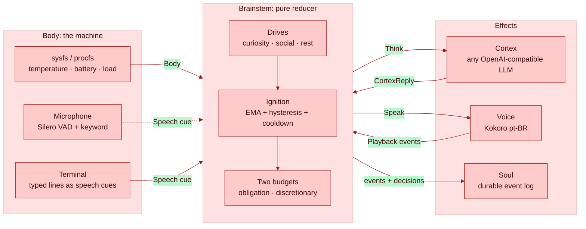
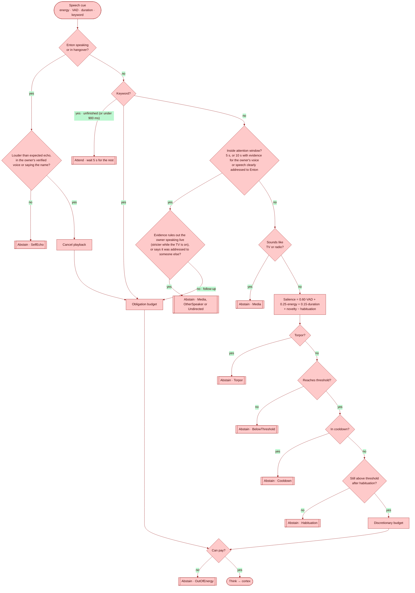
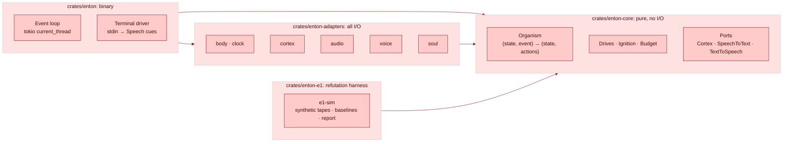

<div align="center">


<br/>



<br/><br/>

[](https://github.com/gabrielmaialva33/enton/actions/workflows/ci.yml)
[](https://www.rust-lang.org)
[](./Cargo.toml)
[](./Cargo.toml)
[](#build-profiles)
[](./crates)
[](./LICENSE)

---

*"I heard you. I just decided you weren't worth a thought, and I wrote down why."*

<sub>Enton</sub>

</div>

---

> [!IMPORTANT]
> **Enton is not a chatbot, and it does not answer everything.** It is a digital organism whose
> body is the machine it runs on. Living is cheap and continuous: clock ticks, body signals,
> voice activity. Thinking is expensive and rare: the LLM (its *cortex*) wakes only when ignition
> fires and the budget can pay for it, and every stimulus it ignores leaves a written reason.
>
> *Still inspired by [Son of Anton](https://silicon-valley.fandom.com/wiki/Son_of_Anton), Gilfoyle's sentient AI from HBO's Silicon Valley.*

> [!NOTE]
> **v1 is a ground-up rewrite in Rust.** v0 was a Python/CUDA stack (YOLO, Whisper, Agno, nine
> desires) that reacted to everything it perceived. v1 inverts the premise: a tiny, deterministic
> brainstem decides *whether* to think, and the whole economy of that decision is auditable.
> The design is fixed by the accepted RFC 0001 *"Organismo"*.

---

## Thesis

1. **Enton is a digital organism.** Its body is the hardware, its economy is auditable, and its learning is reversible.
2. **Life is cheap and continuous; thought is expensive and rare.**
3. **The thesis only holds if it is measured.** [Experiment E1](#experiment-e1) exists to refute it.

---

## Overview


```mermaid
%%{init: {'theme': 'base', 'themeVariables': {'primaryColor': '#fecaca', 'primaryTextColor': '#450a0a', 'primaryBorderColor': '#991b1b', 'secondaryColor': '#bbf7d0', 'secondaryTextColor': '#052e16', 'secondaryBorderColor': '#166534', 'tertiaryColor': '#fee2e2', 'tertiaryTextColor': '#450a0a', 'lineColor': '#991b1b', 'textColor': '#1c1917'}}}%%
flowchart LR
    subgraph Body["Body: the machine"]
        SYS["sysfs / procfs<br/>temperature · battery · load"]
        MIC["Microphone<br/>Silero VAD + keyword"]
        TTY["Terminal<br/>typed lines as speech cues"]
    end

    subgraph Brainstem["Brainstem: pure reducer"]
        direction TB
        DRV["Drives<br/>curiosity · social · rest"]
        IGN["Ignition<br/>EMA + hysteresis + cooldown"]
        BUD["Two budgets<br/>obligation · discretionary"]
        DRV --> IGN --> BUD
    end

    subgraph Effects["Effects"]
        CTX["Cortex<br/>any OpenAI-compatible LLM"]
        VOI["Voice<br/>Kokoro pt-BR"]
        SOUL["Soul<br/>durable event log"]
    end

    SYS -->|Body| Brainstem
    MIC -.->|Speech cue| Brainstem
    TTY -->|Speech cue| Brainstem
    Brainstem -->|Think| CTX
    CTX -->|CortexReply| Brainstem
    Brainstem -->|Speak| VOI
    VOI -->|Playback events| Brainstem
    Brainstem -->|events + decisions| SOUL
```

<sub>Dotted edge: the microphone adapter is implemented and tested, but not yet wired into the `enton` binary.</sub>

| Property | Value |
|:---------|:------|
| **Language** | Rust 2024 · MSRV 1.88 · `unsafe_code = "forbid"` |
| **Runtime** | tokio `current_thread`: one event loop, bounded channels |
| **Crates** | 4: core, adapters, binary, E1 harness |
| **Source** | 17,118 lines of code (tokei, including inline unit tests) + 5,581 lines of tests and examples |
| **Tests** | 254 passing with default features, 335 with all features, including property tests |
| **Lean binary** | 7.0 MiB (5.3 MiB on aarch64), no shared libraries |
| **Cortex** | Any OpenAI-compatible server, local Ollama by default |

---

## Quick Start

```bash
git clone https://github.com/gabrielmaialva33/enton.git && cd enton
cargo build --release -p enton
./target/release/enton --profile desktop --model <a model your server has>
```

The binary talks to an OpenAI-compatible server at `http://127.0.0.1:11434/v1` (Ollama's default).
Each line you type becomes a speech cue; a line containing `enton` counts as being addressed.
Every decision is printed as it happens (lines starting with `>` are what was typed):

```text
> enton
Attend { until: Millis(5000) }
> que horas são?
Think { thought: ThoughtId(1), reason: Keyword, salience: 1.926 }
Speak { text: "..." }
> a tv tá ligada
Abstain { reason: Speech, salience: 0.976, why: Cooldown }
```

"enton" alone is too short to be a request, so Enton **attends** for 5 s and merges the
continuation into a single thought. The later remark, not addressed to it, lands inside the
10 s cooldown, so it **abstains** and says why. Type `quit` to exit.

Everything it perceives and decides is written to its **soul** before it acts, so the next run
resumes exactly where this one stopped, and a thought interrupted by a crash is never repeated.

<details>
<summary><strong>Prerequisites</strong></summary>

| Tool | Version | Required |
|:-----|:--------|:---------|
| Rust | stable, `>= 1.88` | Yes, pinned by `rust-toolchain.toml` |
| OpenAI-compatible LLM server | any | Yes (Ollama, llama.cpp, vLLM, etc.) |
| ONNX models (`~/.cache/enton/models`) | see below | Only for `audio` / `voice` |
| Audio devices (ALSA / PipeWire via cpal) | any | Only for `audio` / `voice` |

</details>

<details>
<summary><strong>Command line</strong></summary>

| Flag | Default | Description |
|:-----|:--------|:------------|
| `--profile t1-ref\|desktop` | `t1-ref` | Hardware profile: thresholds, budgets, torpor limits |
| `--cortex-url <URL>` | `http://127.0.0.1:11434/v1` | OpenAI-compatible base URL |
| `--model <MODEL>` | `qwen3.8:27b-gato` | Model identifier sent to the cortex |
| `--soul <PATH>` | `~/.local/share/enton/soul-<profile>.sqlite` | Durable event log the organism resumes from |
| `--no-soul` | off | Run without recording anything |
| `--voice` | off | Speak replies out loud (needs the `voice` feature) |
| `--speaker <ID>` | `42` (`pf_dora`) | Kokoro speaker ID |

If the cortex is unreachable, Enton keeps living and answers with an offline placeholder.

</details>

<details>
<summary><strong>Voice and microphone</strong></summary>

```bash
# Speak replies out loud: Kokoro pt-BR, sentence by sentence, with barge-in
cargo build --release -p enton --features audio,voice
./target/release/enton --profile desktop --voice

# Microphone diagnostics: VAD endpointing + keyword fallback
cargo run -p enton-adapters --features audio --example listen -- --list
cargo run -p enton-adapters --features audio --example listen -- --seconds 30
cargo run -p enton-adapters --features audio --example listen -- --vad-only
```

Models are never downloaded implicitly. Expected layout:

```text
~/.cache/enton/models/
├── silero_vad.onnx                          # audio: voice activity detection
├── sherpa-onnx-whisper-tiny/                # audio: keyword fallback
│   ├── tiny-encoder.int8.onnx
│   ├── tiny-decoder.int8.onnx
│   └── tiny-tokens.txt
├── kokoro-int8-multi-lang-v1_1/             # voice (falls back to v1_0)
│   ├── model.int8.onnx
│   ├── voices.bin
│   ├── tokens.txt
│   ├── espeak-ng-data/
│   └── dict/                                # optional
└── 3dspeaker_speech_campplus_sv_zh-cn_16k-common.onnx   # voice-id probe
```

The keyword worker can run on another machine over SSH
(`--keyword-ssh HOST --remote-listen PATH --remote-models DIR`).

</details>

---

## Anatomy of a Decision

Every input is an `Event`; every output is an `Action`. This is the path a speech cue takes
through the brainstem. There is no transcript, only energy, voice-activity confidence, duration
and whether the keyword was heard:


```mermaid
%%{init: {'theme': 'base', 'themeVariables': {'primaryColor': '#fecaca', 'primaryTextColor': '#450a0a', 'primaryBorderColor': '#991b1b', 'secondaryColor': '#bbf7d0', 'secondaryTextColor': '#052e16', 'secondaryBorderColor': '#166534', 'tertiaryColor': '#fee2e2', 'tertiaryTextColor': '#450a0a', 'lineColor': '#991b1b', 'textColor': '#1c1917'}}}%%
flowchart TD
    CUE(["Speech cue<br/>energy · VAD · duration · keyword"]) --> ECHO{"Enton speaking<br/>or in hangover?"}
    ECHO -- yes --> BARGE{"Louder than expected echo,<br/>in the owner's verified voice or saying the name?"}
    BARGE -- no --> A_ECHO[["Abstain · SelfEcho"]]
    BARGE -- yes --> CANCEL["Cancel playback"] --> OBL
    ECHO -- no --> KW{"Keyword?"}
    KW -- "yes · unfinished (or under 900 ms)" --> ATTEND[["Attend · wait 5 s for the rest"]]
    KW -- yes --> OBL["Obligation budget"]
    KW -- no --> WIN{"Inside attention window?<br/>5 s, or 10 s with evidence for the owner's voice<br/>or speech clearly addressed to Enton"}
    WIN -- yes --> SPK{"Evidence rules out the owner speaking live<br/>(stricter while the TV is on),<br/>or says it was addressed to someone else?"}
    SPK -- yes --> A_O[["Abstain · Media, OtherSpeaker or Undirected"]]
    SPK -- "no · follow-up" --> OBL
    WIN -- no --> MED{"Sounds like<br/>TV or radio?"}
    MED -- yes --> A_M[["Abstain · Media"]]
    MED -- no --> SAL["Salience = 0.60·VAD + 0.25·energy + 0.15·duration<br/>+ novelty − habituation"]
    SAL --> TORPOR{"Torpor?"}
    TORPOR -- yes --> A_T[["Abstain · Torpor"]]
    TORPOR -- no --> TH{"Reaches threshold?"}
    TH -- no --> A_B[["Abstain · BelowThreshold"]]
    TH -- yes --> CD{"In cooldown?"}
    CD -- yes --> A_C[["Abstain · Cooldown"]]
    CD -- no --> HAB{"Still above threshold<br/>after habituation?"}
    HAB -- no --> A_H[["Abstain · Habituation"]]
    HAB -- yes --> DIS["Discretionary budget"]
    OBL --> PAY{"Can pay?"}
    DIS --> PAY
    PAY -- no --> A_E[["Abstain · OutOfEnergy"]]
    PAY -- yes --> THINK(["Think → cortex"])
```

Internal drives take the same road on every clock tick: pressure grows, is smoothed, and fires
`Think { reason: Drive("curiosity") }` when it crosses the threshold, unless the body is in
torpor or the discretionary budget is empty.

### Why Enton did not think

Abstentions are first-class decisions, not silence. Each one is a counterfactual that can be
audited later to find false negatives.

| Abstention | Meaning |
|:-----------|:--------|
| `BelowThreshold` | Salience did not reach the threshold |
| `Cooldown` | The previous thought was too recent, or hysteresis has not rearmed |
| `OutOfEnergy` | The budget could not pay for a thought |
| `Torpor` | The body has a fever or a critical battery |
| `Habituation` | Suppressed by repetition of similar stimuli |
| `SelfEcho` | Coincided with its own voice and showed no barge-in evidence |
| `OtherSpeaker` | Inside an attention window, the evidence ruled out the owner speaking live |
| `Media` | The sound was reproduced media (TV, radio, music), not a live voice |
| `Undirected` | Inside an attention window, the speech was addressed to someone else |

---

## Architecture


```mermaid
%%{init: {'theme': 'base', 'themeVariables': {'primaryColor': '#fecaca', 'primaryTextColor': '#450a0a', 'primaryBorderColor': '#991b1b', 'secondaryColor': '#bbf7d0', 'secondaryTextColor': '#052e16', 'secondaryBorderColor': '#166534', 'tertiaryColor': '#fee2e2', 'tertiaryTextColor': '#450a0a', 'lineColor': '#991b1b', 'textColor': '#1c1917'}}}%%
graph LR
    subgraph BIN["crates/enton: binary"]
        LOOP["Event loop<br/>tokio current_thread"]
        DRIVER["Terminal driver<br/>stdin → Speech cues"]
    end

    subgraph CORE["crates/enton-core: pure, no I/O"]
        ORG["Organism<br/>(state, event) → (state, actions)"]
        MECH["Drives · Ignition · Budget"]
        PORTS["Ports<br/>Cortex · SpeechToText · TextToSpeech"]
    end

    subgraph ADP["crates/enton-adapters: all I/O"]
        BODY["body · clock"]
        CORTEX["cortex"]
        AUDIO["audio"]
        VOICE["voice"]
        SOUL["soul"]
    end

    subgraph E1["crates/enton-e1: refutation harness"]
        SIM["e1-sim<br/>synthetic tapes · baselines · report"]
    end

    BIN --> CORE
    BIN --> ADP
    ADP --> CORE
    E1 --> CORE
```

| Crate | Responsibility |
|:------|:---------------|
| **`enton-core`** | The brainstem: `(state, event) → (state, actions)`. **No I/O, no clock, no randomness**: time enters as data, so replaying the same event tape with the same profile reproduces the same decisions. Also defines the inference ports, with no implementations |
| **`enton-adapters`** | Everything that touches the world: sensors, clock, microphone, speaker, LLM client, event log. Each module is feature-gated so a lean build compiles only what it runs |
| **`enton`** | The binary: composes core and adapters for a hardware profile and runs the event loop |
| **`enton-e1`** | Experiment E1: synthetic cue tapes, the simple-controller baselines and the pass/fail report |

Boundaries are crossed only through the core's public API.

---

## Subsystems

### Brainstem (`enton-core`)

| Module | Description |
|:-------|:------------|
| **Organism** | The reducer. Routes ticks, body signals, speech cues, cortex replies and playback events into decisions |
| **Drives** | Homeostatic pressures that grow with elapsed time; pressure is the weighted sum of squared levels |
| **Ignition** | EMA-smoothed drive pressure with hysteresis and a shared thought cooldown |
| **Budget** | Two accounts: **obligation** (addressed turns, follow-ups) and **discretionary** (drives, overheard speech), so being addressed never competes with idle curiosity |
| **Habituation & novelty** | A running expectation of recent cues. Repetition suppresses salience on two timescales: a fast component that a surprise resets, and a slow one that outlasts quiet gaps (a TV that pauses is still a TV) and only ever mutes familiar cues |
| **Self-echo model** | Adaptive estimate of its own voice at the microphone, barge-in margins, a consecutive barge-in ratchet and a playback watchdog |
| **Torpor** | Fever or critical battery blocks discretionary thought; being called by name still gets an answer |

### Adapters (`enton-adapters`)

| Module | Feature | Backing | Description |
|:-------|:--------|:--------|:------------|
| **body** | always | sysfs / procfs | Hottest thermal zone, battery charge, load per core |
| **clock** | always | `Instant` | Monotonic milliseconds, the only source of time |
| **cortex** | `cortex` | reqwest + rustls | OpenAI-compatible client: sentence streaming, middle-out history pruning, single-flight, idempotency cache keyed by thought ID |
| **audio** | `audio` | cpal + sherpa-onnx | 16 kHz capture, Silero VAD endpointing, 30 s RAM-only ring, keyword fallback through a bounded Whisper tiny worker (local or SSH) |
| **voice** | `voice` | sherpa-onnx Kokoro + cpal | pt-BR speech, sentence by sentence, instant cancel on barge-in, lifecycle events for what was actually heard |
| **soul** | `soul` | SQLite (WAL, `synchronous=FULL`) | Durable, gap-detecting, replayable event log with organism snapshots, retention and a size cap |
| **voice-id** | `voice-id` | sherpa-onnx CAM++ | `owner_probe` example: measures EER, d′, FAR and FRR for owner speaker verification |

> [!TIP]
> **Privacy by construction.** Raw audio lives only in a 30 s RAM ring and is never written to
> disk. The soul stores reduced cues and decisions (including Enton's own replies), never raw
> audio or what was said to it. The keyword matcher accepts only the whole token *Enton*, never
> *então* or *Benton*. Voiceprints are written with mode `0600` and refused anywhere inside the
> repository.

---

## Drives

| Drive | Weight | Growth per minute | Satisfied by |
|:------|:------:|:-----------------:|:-------------|
| `curiosity` | 0.6 | 0.004 | Nothing yet |
| `social` | 0.6 | 0.003 | Every cortex reply (−0.3) |
| `rest` | 0.2 | 0.002 | Nothing yet |

These are conservative scaffold values, not calibrated physiology: after an hour of silence their
combined pressure is still below both profiles' thresholds. Enton is quiet by default.

---

## Profiles

| Parameter | `t1-ref` | `desktop` |
|:----------|:--------:|:---------:|
| Fever (torpor) | 80 °C | 90 °C |
| Critical battery (torpor) | 10 % | 5 % |
| Obligation budget | 120 / h | 300 / h |
| Discretionary budget | 12 / h | 60 / h |
| Ignition threshold | 0.70 | 0.65 |
| Thought cooldown | 10 s | 5 s |
| Drive EMA α | 0.1 | 0.2 |
| Attention window | 5 s | 5 s |
| Evidence that rules out the owner's live voice | 1 nat | 1 nat |
| Attention window for the owner's verified voice (≥ 0.1 nat) | 10 s | 10 s |
| Evidence that speech was addressed to someone else (turned away inside a window) | 1.5 nats | 1.5 nats |
| Speech clearly addressed to Enton (≥ 1.5 nats) may use the 10 s window | yes | yes |
| Evidence treated as TV/radio | 1 nat | 1 nat |
| Extra strictness while the TV is on | 2 nats | 2 nats |
| Whole request: length (3 nats/s from 900 ms) plus end-of-turn evidence | ≥ 0 | ≥ 0 |
| Gap that joins an unfinished name to its continuation | 1 s | 1 s |
| Habituation half-life | 30 s | 15 s |
| Slow habituation half-life | 20 min | 10 min |
| Playback watchdog | 15 s | 20 s |
| TTS threads | 2 | 8 |

A thought costs one abstract budget unit. **T1-ref** reproduces the constraints of a small board;
**desktop** is a provisional policy with a larger allowance.

---

## Experiment E1

E1 compares Enton against a **simple controller** (VAD + keyword + fixed cooldown) with the same
models, audio and budget. The thesis is refuted if Enton fails any criterion.

- **E1a:** 100 relevant requests (single turns, split turns, conversations, short turns, interruptions).
- **E1b:** 10 commands buried in 50 minutes of noise (TV, another person, motor, ventilation, its own echo).

```bash
cargo run --release -p enton-e1 -- --seed 42               # one seed, full report
cargo run --release -p enton-e1 -- --seeds 0..=31 --summary # pooled over 32 seeds
cargo run --release -p enton-e1 -- --seeds 0..=31 --summary --with-directed # plus a directedness detector
```

**Current status** (synthetic proxy, benchmark 3.1.0, reducer v10, speaker, media and end-of-turn
sensors, report seeds 0 to 31, measured 2026-09-26). One seed is an anecdote, so the table pools 32:

| Criterion (RFC 0001 §7) | Target | Pooled result | Seeds passing | Status |
|:------------------------|:------:|:--------------|:-------------:|:------:|
| Fewer cortex calls than the simple controller | ≥ 50 % | 53.6 % (6020 vs 12968) | 27 / 32 | ⚠️ |
| Relevant requests served (E1a) | ≥ 99 / 100 | 1769 / 3200 | 0 / 32 | ❌ |
| Commands served (E1b) | 10 / 10 | 320 / 320 | 32 / 32 | ✅ |
| Cortex calls during 50 min of noise (E1b) | 0 | 29 (0.9 per seed, at most 2) | 6 / 32 | ❌ |
| Self-ignitions | 0 | needs physical measurement (synthetic proxy: 0) | | pending |
| Added p95 latency | ≤ 100 ms | needs physical measurement | | pending |
| Core RSS over 24 h | stable | needs physical measurement | | pending |

The summary also reports a 95% Clopper-Pearson upper bound on the request miss rate (now
46.2%): a "99 / 100" claim is only worth making once that bound, not a single seed, is below 1%.

Benchmark 3.0.0 replaces idealized sensors with measured ones. Speaker similarity follows CAM++
scores measured on simulated rooms (across the room, the owner scores 0.57 ± 0.13 on a 1.5 s line
and a relative in the same room 0.46 ± 0.15), the media tagger follows published single-microphone
detectors (about a third of TV dialogue missed) and the end-of-turn model follows Smart Turn v3.2 on
real Portuguese pauses (the name alone reads as finished about 20% of the time, confidently). Errors
are correlated: distance and background TV are drawn per three-minute block, the owner's voice has
its own offset, and pause style is shared within a turn. The tapes also add what the organism's
rules could get wrong: the owner talking to someone else inside the window, another person talking
right after a short request, and a distractor right after an unfinished "Enton...". Under these
sensors reducer v8, which read each sensor against a fixed threshold, vetoed 89% of the owner's
follow-ups as someone else's voice and served 1432 / 3200 requests.

Reducer v9 reads sensors as evidence: calibrated log-likelihood ratios in nats, linear in each
reading so replay stays bit-identical, capped at 3 nats and weighed against the owner speaking live.
It also tracks whether a TV is on and is stricter while it is. That serves 1769 / 3200 requests and
a third more turns. With the TV off it serves 72% (far) to 86% (near) of turns; with the TV on, 43
to 47%. With these three sensors one segment tells the owner from a relative with d' of about 0.6
and from a TV voice with d' of about 1.3, so no threshold keeps 99% of the owner's follow-ups and
turns most TV lines away. Closing the gap takes another kind of evidence: whether speech is addressed
to Enton (text-based detection, about 14% equal error rate in published work) or where it comes
from (a microphone array; the TV does not move). Thresholds were chosen on calibration seeds 100 to
131 and are reported here on seeds 0 to 31.

**With a simulated directedness detector** (conservative, desktop-first: needs speech-to-text and
about 0.5 s of CPU per segment for a 4B model). Benchmark 3.1.0 gives every cue a directedness
reading on its own random stream, so no other reading moved: 85% of requests read as clearly
addressed to Enton, as do 12% of the owner's asides and 8% of other people and TV lines, with errors
correlated per owner and per block. E1 withholds the reading unless run with `--with-directed`, and
without it reducer v10 decides every call exactly as v9 did, so the table above stands. With it, v10
turns away speech in a window that reads as addressed to someone else (`Undirected`) and lets speech
clearly addressed to Enton use the 10 s window, both settings chosen on seeds 100 to 131:

**Result with directedness** (seeds 0 to 31): 1896 / 3200 requests (miss-rate bound 42.2%), 4045 /
6400 turns, 58.2% fewer calls than the simple controller (30 / 32 seeds), 29 calls in E1b noise,
0 synthetic self-ignitions.

Waste on the owner's asides falls from 371 calls to 127, on other people from 701 to 415 and on the
TV from 449 to 137. The turns it adds are where the TV is off (far from the device, 72% to 80%);
with the TV on, 44 to 47% of turns are served as before, and 28 of the 29 noise calls are overheard
speech outside any window, where directedness is not consulted.

Every run also watches the reducer at each step, in the spirit of TigerBeetle's VOPR: one
decision per speech cue, thought IDs in order, time never running backward, budgets and
habituation in bounds, and a snapshot round trip every 1000 steps that must keep stepping in
lockstep with the live organism. A violation stops the run.

**Overall: FAIL.** That is the point of E1: the thesis gets published with its refutation
attempt attached. Calibration uses seeds 0 to 999; seeds from 1000 up are a held-out set reserved
for the freeze owner.

---

## From v0 to v1

| | v0 (Python) | v1 (Rust) |
|:--|:------------|:----------|
| **When it thinks** | On every stimulus | Only when ignition fires and a budget pays |
| **Motivation** | 9 desires with heuristic urgency | 3 drives inside a pure, deterministic reducer |
| **Senses** | YOLO, Whisper, CLAP, InsightFace, FER | Body signals, VAD and keyword before any transcription |
| **Memory** | Qdrant episodes | Durable, replayable event log |
| **Voice** | Kokoro in Python | Kokoro via sherpa-onnx, with barge-in |
| **Proof** | 136 unit tests | 254 tests, property tests and a refutation experiment |
| **Footprint** | CUDA + PyTorch | 7.0 MiB binary, no native runtime in the lean build |

Vision is deliberately out of scope for milestone 1.

---

## Build Profiles

The RFC budget for the core binary is **under 20 MB**. Measured on 2026-09-26 (release, stripped, x86_64):

| Profile | Command | Executable | Shared libraries |
|:--------|:--------|:----------:|:-----------------|
| **T1** (lean, default) | `cargo build --release -p enton` | 7.0 MiB | none |
| **Desktop** (static) | `cargo build --release -p enton --features audio,voice` | 35.3 MiB | none (ONNX Runtime linked in) |
| **Desktop** (shared) | `cargo build --release -p enton --features audio,voice,shared-runtime` | 7.2 MiB | `libsherpa-onnx-c-api.so` 4.9 MiB, `libonnxruntime.so` 25.8 MiB |

With `shared-runtime`, both libraries must be on the library path (`LD_LIBRARY_PATH` or a system directory).

<details>
<summary><strong>The T1-ref cage</strong></summary>

T1-ref is a cgroup cage on a notebook. It reproduces the constraints of a small ARM board, not
its performance or power draw:

```bash
systemd-run --user --scope -p MemoryMax=512M -p MemorySwapMax=0 -p CPUQuota=100% \
  target/release/enton --profile t1-ref
```

CI cross-compiles the mind for `aarch64-unknown-linux-musl` with `cargo zigbuild`, smoke-tests it
under `qemu-user` and fails if the core binary breaks the 20 MB budget.
`armv5te-unknown-linux-musleabi` is reserved for the camera (T0), never for the mind.

</details>

---

## Tech Stack

| Layer | Technologies |
|:------|:-------------|
| **Core** | Rust 2024, serde, thiserror; no runtime dependencies |
| **Runtime** | tokio (`current_thread`), bounded `mpsc` channels |
| **Cortex** | reqwest + rustls against any OpenAI-compatible server |
| **Audio** | cpal, sherpa-onnx (Silero VAD, Whisper tiny, Kokoro, CAM++), ONNX Runtime |
| **Storage** | SQLite via rusqlite (bundled, WAL) |
| **Quality** | clippy pedantic with `-D warnings`, `unsafe_code = "forbid"`, cargo-deny, cargo-machete |

---

## Roadmap

Milestone 1 tracks, as named in RFC 0001:

| Track | Status | Description |
|:------|:------:|:------------|
| P1 · Metabolic cognition | done | Drives, ignition, obligation and discretionary budgets |
| D1 · Interoception | done | Thermal, battery and load signals driving torpor |
| D1 · Self-echo | partial | Adaptive echo model and barge-in done; PipeWire AEC next |
| Voice | done | Kokoro pt-BR, sentence streaming, barge-in |
| Cortex | done | OpenAI-compatible, streaming, idempotent |
| P5 · Perception by surprise | next | Capture, VAD and keyword adapter done; wiring into the binary next |
| P4 · Soul | done | Write-ahead event log in the binary, snapshots, crash recovery |
| D2 · Counterfactuals | done | Abstentions with reasons, E1 harness, offline evaluation |
| E1 | in progress | Synthetic proxy currently fails (see above) |
| Owner voice ID | measuring | CAM++ speaker verification probe |
| After M1 | planned | Vision, distillation, multiple bodies, WASM skills |

---

## Contributing

```bash
git checkout -b feature/your-feature
cargo build
cargo test
cargo clippy --all-targets -- -D warnings
cargo fmt
cargo deny check
cargo machete
```

The bar is high-level, idiomatic Rust. Library code never unwraps, panics or indexes unchecked;
no `Result` is swallowed; libraries do not print; everything is bounded. The core stays pure: no
I/O, no clock, no randomness. Code, comments and docs are written in English.

---

<div align="center">

**Star if you believe life should be cheap and thought should be earned**

[](https://github.com/gabrielmaialva33/enton)

*Built with obsession by [Gabriel Maia](https://github.com/gabrielmaialva33)*


</div>
