<div align="center">


[](https://python.org)
[](https://pytorch.org)
[](https://developer.nvidia.com/cuda-toolkit)
[](./tests)
[](./LICENSE)

---

*"I see you. I hear you. I understand you. And sometimes, I roast you."* — Enton

</div>

---

> [!IMPORTANT]
> **Enton is not a chatbot.** He is an autonomous digital entity with perception, emotion,
> desires, and genuine personality. He sees through cameras, hears through microphones,
> speaks with his own voice, and acts on his own will.

---

## 🎯 Overview


| Property | Value |
|:---------|:------|
| **Language** | Python 3.12+ (async, type-safe) |
| **Runtime** | CUDA + PyTorch |
| **Modules** | 46 across 7 subsystems |
| **Source** | 6,292 lines |
| **Tests** | 136 passing |

---

## ⚡ Quick Start

```bash
git clone https://github.com/gabrielmaialva33/enton.git && cd enton
uv sync
uv run enton --webcam --viewer
```

<details>
<summary><strong>📋 Prerequisites</strong></summary>

| Tool | Version | Required |
|:-----|:--------|:---------|
| Python | `>= 3.12` | Yes |
| uv | `latest` | Recommended |
| CUDA | `>= 12.0` | For GPU acceleration |
| NVIDIA GPU | RTX 3090+ | Recommended |

</details>

<details>
<summary><strong>🔧 Environment (.env)</strong></summary>

```env
# Provider routing (local-first)
BRAIN_PROVIDER=local
TTS_PROVIDER=local
STT_PROVIDER=local

# Camera
CAMERA_SOURCE=0                    # webcam
# CAMERAS=main:0,hack:rtsp://...  # multi-camera

# Local models
OLLAMA_MODEL=qwen2.5:14b
WHISPER_MODEL=large-v3-turbo
KOKORO_VOICE=am_onyx

# Cloud providers (optional)
GROQ_API_KEY=
GOOGLE_PROJECT=
NVIDIA_API_KEY=
OPENROUTER_API_KEY=
```

</details>

---

## 🏗️ Architecture

```mermaid
%%{init: {'theme': 'base', 'themeVariables': { 'primaryColor': '#00ff88', 'primaryTextColor': '#fff', 'primaryBorderColor': '#00d4ff', 'lineColor': '#8b5cf6', 'secondaryColor': '#0a0a1a'}}}%%
graph TB
    subgraph PERCEPTION["👁️ PERCEPTION"]
        V[Vision<br/>YOLO11s + Pose + Emotion]
        E[Ears<br/>Whisper + Silero VAD]
        S[Sounds<br/>CLAP open-set]
        F[Faces<br/>InsightFace]
    end

    subgraph CORE["⚙️ CORE"]
        BUS[EventBus<br/>async pub/sub]
        SM[SelfModel<br/>mood + senses]
        MEM[Memory<br/>Qdrant + episodes]
        CFG[Config<br/>pydantic-settings]
    end

    subgraph COGNITION["🧠 COGNITION"]
        BRAIN[EntonBrain<br/>Agno Agent + fallback chain]
        FUSER[Fuser<br/>multi-modal context]
        DES[DesireEngine<br/>9 autonomous desires]
        PLAN[Planner<br/>reminders + routines]
    end

    subgraph SKILLS["🛠️ SKILLS (10 Agno Toolkits)"]
        SH[Shell + Files]
        SR[Search]
        PT[PTZ Control]
        DS[Describe Scene]
        FC[Face Recognition]
        SY[System Monitor]
        ME[Memory Tools]
        PL[Planner Tools]
    end

    subgraph ACTION["🔊 ACTION"]
        VOICE[Voice<br/>Kokoro / Google / NVIDIA TTS]
        VIEWER[Viewer<br/>Cyberpunk HUD + grid]
    end

    PERCEPTION --> BUS
    BUS --> CORE
    CORE --> COGNITION
    COGNITION --> SKILLS
    COGNITION --> ACTION
    SKILLS --> BRAIN
```



---

## 🧠 Subsystems

### Perception

| Module | Model | Device | Description |
|:-------|:------|:-------|:------------|
| **Vision** | YOLO11s + YOLO11s-pose | `cuda:0` FP16 | Object detection, pose estimation, multi-camera |
| **Ears** | Faster-Whisper large-v3-turbo | `cuda` FP16 | STT with streaming partial transcription |
| **Sounds** | CLAP (laion) | `cuda` | Open-set ambient sound classification |
| **Faces** | InsightFace + ArcFace | `cuda` | Face recognition and identity tracking |
| **Emotion** | FER (CNN) | `cuda` | Real-time facial emotion recognition |

### Cognition

| Module | Description |
|:-------|:------------|
| **Brain** | Agno Agent with multi-provider fallback chain (Local → Groq → OpenRouter → Google → NVIDIA → HuggingFace) |
| **DesireEngine** | 9 autonomous desires with urgency curves, mood modulation, cooldowns |
| **Fuser** | Combines detections + activities + emotions into coherent scene context |
| **Planner** | Task management, reminders, daily routines |
| **SelfModel** | Internal state: mood (engagement/social), senses, introspection |

### Action

| Module | Description |
|:-------|:------------|
| **Voice** | Multi-provider TTS (Kokoro local, Google Cloud, NVIDIA Riva) with auto mic-mute |
| **Shell** | Persistent CWD, background processes, command safety classification |
| **Files** | Read/write/edit/find/grep with security layers |
| **PTZ** | Physical camera motor control via ioctl |

---

## 🎭 Desire Engine

Enton has 9 autonomous desires that emerge from his internal state:

| Desire | Trigger | Cooldown | Description |
|:-------|:--------|:---------|:------------|
| 🗣️ `socialize` | Low social mood | 10min | Wants to chat |
| 👁️ `observe` | Boredom | 2min | Wants to look around |
| 📚 `learn` | Curiosity | 30min | Searches for new knowledge |
| 💬 `check_on_user` | Long absence | 1h | Checks if Gabriel is okay |
| ⚙️ `optimize` | Background | 30min | Monitors system resources |
| 💭 `reminisce` | Idle | 15min | Recalls a memory |
| ✨ `create` | Low engagement | 1h | Writes code, poems, jokes |
| 🔭 `explore` | Boredom | 10min | Moves camera, explores environment |
| 🎮 `play` | High engagement | 15min | Tells jokes, proposes quizzes |

Desires have **urgency** (0→1) that grows over time and is modulated by mood, sounds, and interactions.

---

## 📊 Tech Stack

| Layer | Technologies |
|:------|:-------------|
| **Core** | Python 3.12, asyncio, Pydantic, FastAPI |
| **AI Agent** | Agno Framework (Ollama, Groq, Google, NVIDIA, OpenRouter) |
| **Vision** | PyTorch, Ultralytics YOLO11, InsightFace, OpenCV |
| **Audio** | Faster-Whisper, Silero VAD, Kokoro TTS, CLAP |
| **Storage** | Qdrant (vectors), Redis (state), TimescaleDB (metrics) |
| **Infra** | Docker Compose, GitHub Actions CI, uv |

---

## 🗺️ Roadmap

| Phase | Status | Description |
|:------|:------:|:------------|
| Genesis | ✅ | Core architecture + event bus |
| Perception | ✅ | Vision (YOLO + pose + emotion + face) |
| Voice | ✅ | Kokoro TTS + Whisper STT + VAD |
| Brain | ✅ | Agno agent + multi-provider fallback |
| Personality | ✅ | Persona, mood, desires, memory |
| Coding Agent | ✅ | Shell + file tools with security |
| Multi-Camera | ✅ | Parallel processing + grid viewer |
| STT Streaming | ✅ | Partial transcription during speech |
| Sound Intelligence | ✅ | CLAP + brain-driven reactions |
| Dashboard | 🔄 | Web UI with live metrics |
| Embodiment | ⏳ | Physical robot integration |
| Long-term Memory | ⏳ | Persistent episodic + semantic memory |

---

## 🤝 Contributing

```bash
git checkout -b feature/your-feature
uv run ruff check src/ tests/   # lint
uv run pytest tests/ -x -q      # 136 should pass
```

---

<div align="center">

**Star if you believe in digital life ⭐**

[](https://github.com/gabrielmaialva33/enton)

*Built with obsession by [Gabriel Maia](https://github.com/gabrielmaialva33)*


</div>
